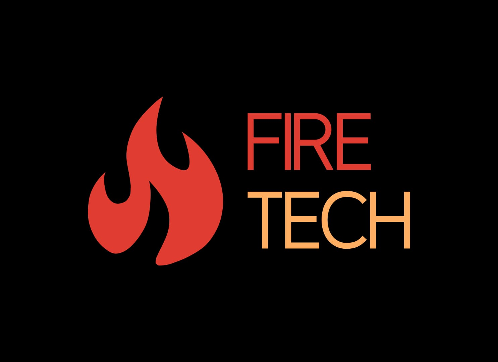

# Firer Detector with Python




> Fire detection and prevention system for green areas using OpenCV.

## 💻 Requeriments

Antes de começar, verifique se você atendeu aos seguintes requisitos:

- Last update of Python language.
- Have this libraries installed: Pillow, OpenCv, Imutils, Time, Threading, Playsound, Numpy and Urllib.
- Windows or Linux for running the application (MacOS don't was tested).

## 🚀 Installing Firer Detector System

To install the Firer Detector on your system, simply open Terminal in the folder you chose and import:

```
git clone https://github.com/augustotcoliveira/pythonprojects-firetech.git

```

## ☕ Using Firer Detector

To use the system, follow the steps below:

- Execute FirerGUI.py
- With the system running, choose and click in the video you want to test, video 1 or video 2
- After choose and click, click in the Detection button, and see the system working :)
- After the detection, click on the finalize button to stop de process (you need to do that, otherwise the system can stop working)


## 😄 That's it

Some more informations:
  - "Monitoramento" unfortunately doesn't work in this setup. This function has been used in the past for my course final work presentation, but, if you want, you can setup and configure a new ESP32-CAM to use it.
  - This is a project that is not finished yet. In the last few days i have been working on it to make a better version, so as soon as possible the new version will be uploaded here :)

